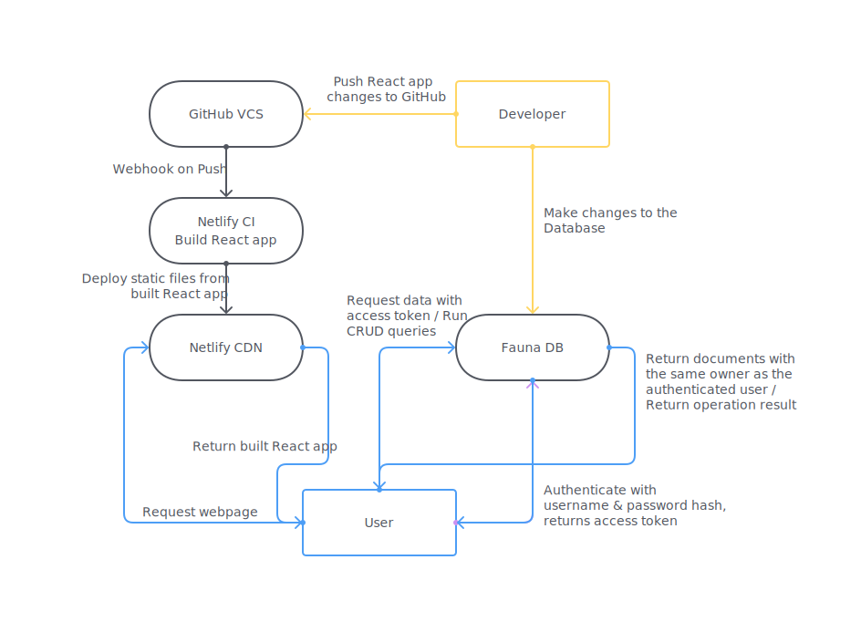

# SE_19 todolist

Hey 👋 This is my assessment project for SE_19. 
It is deployed at [todolist.koenidv.de](https://todolist.koenidv.de).

## Setting up your environment

1. Once you cloned the repo, make sure to run `npm install` to install all dependencies.
2. Run `npm start` and a server will start on localhost. That's it!
3. This project uses [Fauna](https://fauna.com), a serverless document database. A public key for this database is already included. If you want to use your own Fauna instance, that's easy.

### Setting up a custom Fauna instance

1. After creating a Fauna account and a database for this project, go to your Web Shell and run the 3 queries provided in [FaunaSetup.md](/FaunaSetup.md).
2. Head to Security and create a new key using the new *client* role. Copy the generated key.
3. Paste this key into the `PUBLIC_CLIENT_KEY` constant in [faunaAuth](/src/auth/faunaAuth.js). If you have selected a region other than *EU*, make sure to also update the domain used in the client creation.
4. Done! You will use your own Fauna instance now.

## User Flow Chart

The React app is hosted on [Netlify](https://netlify.com), and is using Netlify's CI to build the app from GitHub.

[Click here to view the User Flow Chart on FlowMapp](https://app.flowmapp.com/share/de244f2c4ed86c7e059dcd9c84ec2305/userflow/187927/)